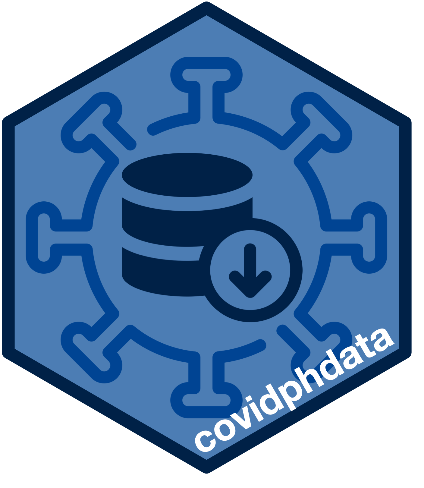

<!-- README.md is generated from README.Rmd. Please edit that file -->

# covidphdata: An Interface to the Philippines Department of Health COVID-19 Data Drop 

<!-- badges: start -->

[](https://www.tidyverse.org/lifecycle/#experimental)


[](https://codecov.io/gh/como-ph/covidphdata?branch=master)
[](https://www.codefactor.io/repository/github/como-ph/covidphdata)
<!-- badges: end -->

The [Philippines Department of Health](https://www.doh.gov.ph) has made
COVID-19 related data publicly available as part of its mandate to
promoting transparency and accountability in governance. The Philippines
COVID-19 Data Drop is distributed via *Google Drive* with latest updated
data provided daily (generally). Data from previous days are archived
and also made available through *Google Drive*. This package provides a
coherent, robust and performant API to the latest and archived
Philippines COVID-19 data.

## Motivation and development history

In early April 2020 as part of [CoMo
Philippines](https://como-ph.github.io)’s contribution to the [CoMo
Consortium](https://www.tropicalmedicine.ox.ac.uk/news/como-consortium-the-covid-19-pandemic-modelling-in-context)’s
work in COVID-19 modelling for the Philippines context, we developed an
[R](https://cran.r-project.org) package called
[`comoparams`](https://como-ph.github.io/comoparams) that provided
[R](https://cran.r-project.org) functions for access, handling and
processing of relevant data required for COVID-19 modelling parameters
for the Philippines. Within the
[`comoparams`](https://como-ph.github.io/comoparams) package was a set
of functions developed to interface with the then [newly-announced
Philippines Department of Health Data Drop for
COVID-19](https://www.facebook.com/OfficialDOHgov/posts/announcement-covid-19-data-drop-now-accessible-onlinecovid-19-related-data-now-a/3227811310563432/).
From then until late June 2020, we continued maintenance of the
[`comoparams`](https://como-ph.github.io/comoparams) package.
Specifically, the set of functions for interfacing with the **DoH Data
Drop** required several functions updates (see history of issues and
changes to the package
[here](https://github.com/como-ph/comoparams/issues?q=is%3Aissue)) in
relation to noted issues with the **DoH Data Drop** system and the data
it provides. A good discussion of some of these issues by the **UP
COVID-19 Pandemic Response Team** can be found
[here](https://www.up.edu.ph/prevailing-data-issues-in-the-time-of-covid-19-and-the-need-for-open-data/).
Other issues that required syntax-breaking changes to the
[`comoparams`](https://como-ph.github.io/comoparams) package functions
were related to how the DoH Data Drop was released and distributed.
Earlier during its first release, the **DoH Data Drop** was distributed
through *Google Sheets* via a single non-changing link. This was for
both latest release and the archived data. A few weeks later, the **DoH
Data Drop** was moved to *Google Drive* again via a single non-changing
link for both the latest and the archive data. A month or so after,
release of the latest **DoH Data Drop** was distributed through a single
link that changed during every release (usually daily). The archive
data, on the other hand, was distributed through a different but
constant [link](https://bit.ly/DataDropArchives). The **DoH Data Drop**
distribution system has since remained as such up to date though the
archive data now only includes the current month archive compared to
what it was in late June 2020 when all previous months of archive data
were available.

Currently, given the still persistent issues raised with regard to the
DoH Data Drop system and the datasets it distributes, we felt it was
important to create a separate focused [R](https://cran.r-project.org)
package just for accessing, handling and processing of the DoH Data Drop
that can be universally used by other [R](https://cran.r-project.org)
users regardless of their ultimate end-use for the data (e.g.,
reporting, visualisation, modelling, etc.). We also wanted to contribute
to the work of fellow scientists and researchers in the Philippines whom
we are familiar with and whom we know use
[R](https://cran.r-project.org) for the epidemiologic analysis work they
perform which they share with the general public in the Philippines.
From our own experiences of dealing with the **DoH Data Drop**, we felt
that it would be extremely helpful for fellow scientists and researchers
who use [R](https://cran.r-project.org) to have consistent and
performant data access, handling and processing functions to interface
with the **DoH Data Drop** that can potentially reduce the daily and/or
weekly workload of producing COVID-19 analysis and reports and
streamline their routine analytical workflows.

To this end, we took inspiration from the functions we developed in the
[`comoparams`](https://como-ph.github.io/comoparams) package and
developed this `covidphdata` package based on the following
[R](https://cran.r-project.org) package design principles:

  - use of a **modular and refactorable approach** to determining and
    developing the functions required;

  - creation of an [R](https://cran.r-project.org)-based **robust and
    performant application programme interface or API** to the *Google
    Drive*-based **DoH Data Drop**;

  - application of **modern data handling and processing techniques**
    available in [R](https://cran.r-project.org); and,

  - output of **coherent and compliant data structures** ready for
    various applications.

Finally, we want to contribute to the both the *public discourse* and to
the *practice* of **open data** and **open science** in the Philippines
and encourage others to do the same. Our group’s codebase for our work
on COVID-19 modelling (primarily in [R](https://cran.r-project.org)
language for statistical computing) is available publicly via
[GitHub](https://github.com/como-ph) including the one for the
`covidphdata` package (see <https://github.com/como-ph/covidphdata>).
Our hope is that by creating this package and making its use available
to all [R](https://cran.r-project.org) users and its codebase open
source, we can standardise accessing, handling and processing of the
**DoH Data Drop** thereby providing transparency to the approaches
applied to the data before it is analysed or visualised.

## What does `covidphdata`do?

The `covidphdata` primarily provides functions that serve as low-level
wrappers to specific [`googledrive`](http://googledrive.tidyverse.org)
package functions that support the access to files and folders contained
in a *Google Drive* given that the **DoH Data Drop** is distributed
through this platform.

Currently, the `covidphdata` package:

  - Provides functions (`datadrop_id*`) to dynamically retrieve unique
    **DoH Data Drop** file and folder identifiers used by *Google
    Drive*;

  - Provides a function (`datadrop_ls`) to list the files and folders
    within a specified **DoH Data Drop** folder in *Google Drive*;

  - Provides a function (`datadrop_download`) to download a specified
    file within **DoH Data Drop** in *Google Drive*; and,

  - Provides functions (`datadrop_get`) to retrieve a specified file
    within **DoH Data Drop** in *Google Drive* into
    [R](https://cran.r-project.org).

## Installation

<!---
You can install the released version of covidphdata from [CRAN](https://CRAN.R-project.org) with:

``` r
install.packages("covidphdata")
```
--->

`covidphdata` is not yet available on
[CRAN](https://cran.r-project.org).

The development version of `covidphdata` can be installed via GitHub
using the `remotes` package:

``` r
if(!require(remotes)) install.packages("remotes")
remotes::install_github("como-ph/covidphdata")
```

## Usage

### Google authentication

The **DoH Data Drop** is distributed via *Google Drive* as shared
folders and files that can be accessed by anyone with a link. From a
user who accesses the **DoH Data Drop** interactively (i.e., clicking
the **DoH Data Drop** daily link and then accessing the folders and
files on *Google Drive* on the browser), this would mean that one
doesn’t have to be an authorised user to access the files. On the
other hand, for an [R](https://cran.r-project.org) user, it would be
convenient to be able to access and retrieve the **DoH Data Drop**
folders and files within [R](https://cran.r-project.org) without having
to do a seprate steps of dealing with going to a browser and downloading
the data from the **DoH Data Drop** before being able to access them in
[R](https://cran.r-project.org). This is the main use case for the
`covidphdata` package.

The `covidphdata` is built on the key functionalities of the
`googledrive` package and follows the basic workflow of data retrieval
from *Google Drive*. The `googledrive` package requires authenticating
with *Google Drive* and has functions that facilitate this specifically
its `drive_auth` function. So, the easiest way to authenticate as a
*Google Drive* user is to make a call to the `drive_auth` function as
follows:

``` r
## Load googledrive package
library(googledrive)

## Authenticate with Google
drive_auth()
```

This function when called will open the browser to allow the user to
login their username and password to their *Google* account. This is the
easiest approach to authenticate as most users will be able to implement
this easily. Also, this step will only have to be done per session which
will be enough to use `covidphdata` to retrieve the data one needs into
[R](https://cran.r-project.org). After that, all operations one needs to
do will be with dealing with the data that is within
[R](https://cran.r-project.org) which doesn’t require accessing *Google
Drive* again. However, it is possible that if at some point later within
the same session you need to access different dataset from the archive
that you will need to authenticate again. If this is the case, you will
be asked on your [R](https://cran.r-projectd.org) console to confirm the
email account that you previously logged in with and your
[R](https://cran.r-project.org) session will continue to use those
authentication details.

This is the most straightforward and easiest way to authenticate with
*Google Drive* for most users. However, if you prefer a non-interactive
way of authenticating, read this [good
article](https://googledrive.tidyverse.org/articles/articles/bring-your-own-app.html)
from the `googledrive` package creators on the alternative ways to
authenticate that doesn’t require interactive input.

Once authenticated, one can now proceed with the `covidphdata` data
retrieval workflow outlined below.

### The `covidphdata` data retrieval workflow

The different functions currently available through `covidphdata` are
linked through the following general workflow:

``` r
## Load covidphdata and googledrive package
library(covidphdata)
library(googledrive)

## Step 1: Authenticate as a Google Drive user
googledrive::drive_auth()

## Step 2: Get Google Drive ID for latest DoH Data Drop
gid <- datadrop_id()

## Step 3: List the files and folders available in the latest DoH Data Drop
data_list <- datadrop_ls(id = gid)

## Step 4: Retrieve the specified/required dataset and load into R
datadrop_get(tbl = data_list, fn = "Case Information", path = tempfile())
```

This workflow produces the following output:

    #> # A tibble: 412,097 x 22
    #>    CaseCode   Age AgeGroup Sex   DateSpecimen DateResultRelea… DateRepConf
    #>    <chr>    <dbl> <chr>    <chr> <chr>        <chr>            <chr>      
    #>  1 C516975     51 50 to 54 MALE  2020-09-03   2020-09-03       2020-09-05 
    #>  2 C643966     25 25 to 29 MALE  2020-08-28   2020-09-09       2020-09-10 
    #>  3 C835097     23 20 to 24 FEMA… 2020-08-15   2020-08-17       2020-08-20 
    #>  4 C176417     73 70 to 74 MALE  2020-08-13   2020-08-17       2020-08-19 
    #>  5 C940421     22 20 to 24 MALE  2020-06-24   2020-06-29       2020-07-04 
    #>  6 C650556     26 25 to 29 MALE  2020-10-25   2020-10-28       2020-10-31 
    #>  7 C549944     32 30 to 34 MALE  2020-06-19   2020-06-23       2020-06-26 
    #>  8 C887500     25 25 to 29 FEMA… 2020-06-24   2020-06-29       2020-07-04 
    #>  9 C352799     41 40 to 44 FEMA… 2020-09-27   2020-09-29       2020-10-01 
    #> 10 C776384     49 45 to 49 FEMA… 2020-09-14   2020-09-15       2020-09-17 
    #> # … with 412,087 more rows, and 15 more variables: DateDied <chr>,
    #> #   DateRecover <chr>, RemovalType <chr>, Admitted <chr>, RegionRes <chr>,
    #> #   ProvRes <chr>, CityMunRes <chr>, CityMuniPSGC <chr>, BarangayRes <chr>,
    #> #   BarangayPSGC <chr>, HealthStatus <chr>, Quarantined <chr>, DateOnset <chr>,
    #> #   Pregnanttab <chr>, ValidationStatus <chr>

The functions in the `covidphdata` workflow were designed to be usable
with piped operations provided by the
[`magrittr`](https://magrittr.tidyverse.org) package. The pipe operator
`%>%` can be used with the `covidphdata` workflow as follows:

``` r
## Load magrittr package
library(magrittr)

## Retrieve latest Case Information dataset from DoH Data Drop
datadrop_id() %>%                                 ## Step 1
  datadrop_ls() %>%                               ## Step 2
  datadrop_get(fn = "Case Information",           ## Step 3
               path = tempfile())                 
```

This outputs this result:

    #> # A tibble: 412,097 x 22
    #>    CaseCode   Age AgeGroup Sex   DateSpecimen DateResultRelea… DateRepConf
    #>    <chr>    <dbl> <chr>    <chr> <chr>        <chr>            <chr>      
    #>  1 C516975     51 50 to 54 MALE  2020-09-03   2020-09-03       2020-09-05 
    #>  2 C643966     25 25 to 29 MALE  2020-08-28   2020-09-09       2020-09-10 
    #>  3 C835097     23 20 to 24 FEMA… 2020-08-15   2020-08-17       2020-08-20 
    #>  4 C176417     73 70 to 74 MALE  2020-08-13   2020-08-17       2020-08-19 
    #>  5 C940421     22 20 to 24 MALE  2020-06-24   2020-06-29       2020-07-04 
    #>  6 C650556     26 25 to 29 MALE  2020-10-25   2020-10-28       2020-10-31 
    #>  7 C549944     32 30 to 34 MALE  2020-06-19   2020-06-23       2020-06-26 
    #>  8 C887500     25 25 to 29 FEMA… 2020-06-24   2020-06-29       2020-07-04 
    #>  9 C352799     41 40 to 44 FEMA… 2020-09-27   2020-09-29       2020-10-01 
    #> 10 C776384     49 45 to 49 FEMA… 2020-09-14   2020-09-15       2020-09-17 
    #> # … with 412,087 more rows, and 15 more variables: DateDied <chr>,
    #> #   DateRecover <chr>, RemovalType <chr>, Admitted <chr>, RegionRes <chr>,
    #> #   ProvRes <chr>, CityMunRes <chr>, CityMuniPSGC <chr>, BarangayRes <chr>,
    #> #   BarangayPSGC <chr>, HealthStatus <chr>, Quarantined <chr>, DateOnset <chr>,
    #> #   Pregnanttab <chr>, ValidationStatus <chr>

The resulting dataset retrieved by the piped operation is exactly the
same as the first example. However, the piped operation workflow is more
streamlined. Either of these approaches can be used when retrieving
datasets from the **DoH Data Drop**.

#### Step 1: Get Google Drive ID for DoH Data Drop

The Philippines [Department of Health (DoH)](https://www.doh.gov.ph)
currently distributes the latest **Data Drop** via a fixed shortened URL
([bit.ly/DataDropPH](https://bit.ly/DataDropPH)) which links/points to a
new *Google Drive* endpoint daily or whenever the daily updated **DoH
Data Drop** is available. This *Google Drive* endpoint is a **README**
document in portable document format (PDF) which contains a *privacy and
confidentiality statement*, *technical notes with regard to the latest
data*, *technical notes with regard to previous (archive data)* and *two
shortened URLs* - one linking to the *Google Drive* folder that contains
all the latest officially released datasets, and the other linking to
the datasets released previously (archives). Of these, the first
shortened URL linking to the *Google Drive* folder containing the latest
officially released datasets is different for every release and can only
be obtained through the **README** document released for a specific day.

The function `datadrop_id_latest()` reads that PDF file, extracts the
shortened URL for the latest official released datasets written in that
file, expands that shortened URL and then extracts the unique *Google
Drive* ID for the latest officially released datasets. With this *Google
Drive* ID, other functions can then be used to retrieve information and
data from the *Google Drive* specified by this ID.

The **DoH Data Drop** archives, on the other hand, is distributed via a
fixed shortened URL ([bit.ly/DataDropArchives](bit.ly/DataDropArchives))
which links/points to a *Google Drive* folder containing the previous
**DoH Data Drop** releases.

The function `datadrop_id_archive` expands that shortened URL and then
extracts the unique *Google Drive* ID for the **DoH Data Drop** archives
folder. With this *Google Drive* ID, other functions can then be used to
retrieve information and data from the *Google Drive* specified by this
ID.

The function `datadrop_id` wraps these two `datadrop_id_*` functions and
outputs the appropriate *Google Drive* ID based on specified parameters.
The default output of `datadrop_id` is the *Google Drive* ID of the
latest officially released datasets as shown below:

``` r
datadrop_id()
#> [1] "1ewdxS73FrnH6UgxPWTTW2OrC2skNfyci"
```

To get the *Google Drive* ID of a **DoH Data Drop** archive, the
following parameters need to be set:

``` r
datadrop_id(version = "archive", .date = "2020-11-01")
#> [1] "1O2Gt_MUPKtWWPK6ainagRiehK0pCH7Nv"
```

#### Step 2: List the files and folders available in the latest DoH Data Drop

Once an appropriate *Google Drive* ID is obtained, this can be used with
the `datadrop_ls` function to retrieve a listing of all the files and
folders within the specified *Google Drive*:

``` r
## List the files and folders inside the latest Google Drive DoH Data Drop
gid <- datadrop_id()
datadrop_ls(id = gid)
#> # A tibble: 13 x 3
#>    name                                      id                  drive_resource 
#>  * <chr>                                     <chr>               <list>         
#>  1 DOH COVID Data Drop_ 20201118 - 08 Quara… 1BWlDChxLOJzeehk5s… <named list [3…
#>  2 DOH COVID Data Drop_ 20201118 - 04 Case … 1fYJl0hbiYaq4vPsfb… <named list [3…
#>  3 DOH COVID Data Drop_ 20201118 - 05 DOH D… 18JumMvqHDLvtLzTh0… <named list [3…
#>  4 DOH COVID Data Drop_ 20201118 - 12 DDC T… 1EodO_D2flCenzeqOO… <named list [3…
#>  5 DOH COVID Data Drop_ 20201118 - 11 DOH D… 1e2gfjgqwN604tprFm… <named list [3…
#>  6 DOH Data Drop 20201118 - Changelog.xlsx   1VRHQ38Hwft_bZRCXo… <named list [3…
#>  7 DOH COVID Data Drop_ 20201118 - 10 DOH D… 1vciPP-xK6B5X6RL3O… <named list [3…
#>  8 DOH COVID Data Drop_ 20201118 - 09 Quara… 1TVeE0sP0QQX5BgORA… <named list [3…
#>  9 DOH COVID Data Drop_ 20201118 - 06 DOH D… 1-6DnQTzSc3QP_NGTG… <named list [3…
#> 10 DOH COVID Data Drop_ 20201118 - 02 Metad… 1rJjjtJ0_Dfz6xuxij… <named list [3…
#> 11 DOH COVID Data Drop_ 20201118 - 03 Metad… 1Y0Ilzp2zTwJ7NRZZq… <named list [3…
#> 12 DOH COVID Data Drop_ 20201118 - 07 Testi… 1_WEcJ9NVAREfclVLI… <named list [3…
#> 13 01 READ ME FIRST (11_18).pdf              1jbrSbaE2cLfoaUuH5… <named list [3…
```

``` r
## List the files and folders inside the Google Drive DoH Data Drop on 
## 1 November 2020
gid <- datadrop_id(version = "archive", .date = "2020-11-01")
datadrop_ls(id = gid)
#> # A tibble: 13 x 3
#>    name                                      id                  drive_resource 
#>  * <chr>                                     <chr>               <list>         
#>  1 DOH COVID Data Drop_ 20201101 - 08 Quara… 19qpm1UseQrSmELji8… <named list [3…
#>  2 DOH COVID Data Drop_ 20201101 - 04 Case … 1G3RITnBxmO0qIYAOG… <named list [3…
#>  3 DOH COVID Data Drop_ 20201101 - 06 DOH D… 1XAo_lunz5HXZpGnF1… <named list [3…
#>  4 DOH COVID Data Drop_ 20201101 - 05 DOH D… 1D6sO0tNudLENeiMzK… <named list [3…
#>  5 DOH Data Drop 20201101 - Changelog.xlsx   1KHWj0Mo__y0UqkXfm… <named list [3…
#>  6 DOH COVID Data Drop_ 20201101 - 07 Testi… 1eW8C062WTfMJC9mn2… <named list [3…
#>  7 DOH COVID Data Drop_ 20201101 - 12 DDC T… 1DRYzj6m7HALBM2sVy… <named list [3…
#>  8 DOH COVID Data Drop_ 20201101 - 10 DOH D… 16KEnIvD4ol4oQrtu8… <named list [3…
#>  9 DOH COVID Data Drop_ 20201101 - 02 Metad… 1m8zDRFJ5qKHky60zb… <named list [3…
#> 10 DOH COVID Data Drop_ 20201101 - 09 Quara… 1YarEezOL_wtdtBhFZ… <named list [3…
#> 11 DOH COVID Data Drop_ 20201101 - 11 DOH D… 1_Y8dx3ogvJN0RMHYv… <named list [3…
#> 12 DOH COVID Data Drop_ 20201101 - 03 Metad… 1a4yFn9jxGgDQ3_StU… <named list [3…
#> 13 01 READ ME FIRST (11_01).pdf              1sipJeeWgMqmS5cYv5… <named list [3…
```

#### Step 3: Retrieve the specified/required dataset and load into R

Finally, using the specific *Google Drive* ID for the file of interest,
the `datadrop_id_file` function is used to retrieve the file and output
it into [R](https://cran.r-project.org):

``` r
## Retrieve the latest Case Information file in the DoH Data Drop
gid <- datadrop_id()
tab <- datadrop_ls(id = gid)
datadrop_get(tbl = tab, fn = "Case Information", path = tempfile())
#> # A tibble: 412,097 x 22
#>    CaseCode   Age AgeGroup Sex   DateSpecimen DateResultRelea… DateRepConf
#>    <chr>    <dbl> <chr>    <chr> <chr>        <chr>            <chr>      
#>  1 C516975     51 50 to 54 MALE  2020-09-03   2020-09-03       2020-09-05 
#>  2 C643966     25 25 to 29 MALE  2020-08-28   2020-09-09       2020-09-10 
#>  3 C835097     23 20 to 24 FEMA… 2020-08-15   2020-08-17       2020-08-20 
#>  4 C176417     73 70 to 74 MALE  2020-08-13   2020-08-17       2020-08-19 
#>  5 C940421     22 20 to 24 MALE  2020-06-24   2020-06-29       2020-07-04 
#>  6 C650556     26 25 to 29 MALE  2020-10-25   2020-10-28       2020-10-31 
#>  7 C549944     32 30 to 34 MALE  2020-06-19   2020-06-23       2020-06-26 
#>  8 C887500     25 25 to 29 FEMA… 2020-06-24   2020-06-29       2020-07-04 
#>  9 C352799     41 40 to 44 FEMA… 2020-09-27   2020-09-29       2020-10-01 
#> 10 C776384     49 45 to 49 FEMA… 2020-09-14   2020-09-15       2020-09-17 
#> # … with 412,087 more rows, and 15 more variables: DateDied <chr>,
#> #   DateRecover <chr>, RemovalType <chr>, Admitted <chr>, RegionRes <chr>,
#> #   ProvRes <chr>, CityMunRes <chr>, CityMuniPSGC <chr>, BarangayRes <chr>,
#> #   BarangayPSGC <chr>, HealthStatus <chr>, Quarantined <chr>, DateOnset <chr>,
#> #   Pregnanttab <chr>, ValidationStatus <chr>
```

``` r
## Retrieve the archive Case Information file in the DoH Data Drop
## on 1 November 2020
gid <- datadrop_id(version = "archive", .date = "2020-11-01")
tab <- datadrop_ls(id = gid)
datadrop_get(tbl = tab, fn = "Case Information", path = tempfile())
#> # A tibble: 383,113 x 22
#>    CaseCode   Age AgeGroup Sex   DateSpecimen DateResultRelea… DateRepConf
#>    <chr>    <dbl> <chr>    <chr> <chr>        <chr>            <chr>      
#>  1 C545959     23 20 to 24 FEMA… "2020-08-15" "2020-08-16"     2020-08-19 
#>  2 C542194     40 40 to 44 MALE  "2020-07-28" "2020-07-30"     2020-08-03 
#>  3 C805584     31 30 to 34 MALE  ""           ""               2020-07-31 
#>  4 C656786     51 50 to 54 FEMA… "2020-07-13" "2020-07-14"     2020-07-17 
#>  5 C345520     23 20 to 24 MALE  ""           ""               2020-05-20 
#>  6 C700565     50 50 to 54 MALE  "2020-07-29" "2020-07-31"     2020-08-05 
#>  7 C290814     68 65 to 69 MALE  "2020-05-23" ""               2020-05-30 
#>  8 C197757     34 30 to 34 MALE  "2020-07-16" "2020-07-20"     2020-07-23 
#>  9 C679290     49 45 to 49 MALE  "2020-06-03" "2020-06-04"     2020-06-07 
#> 10 C667799     28 25 to 29 FEMA… "2020-07-10" "2020-07-15"     2020-08-08 
#> # … with 383,103 more rows, and 15 more variables: DateDied <chr>,
#> #   DateRecover <chr>, RemovalType <chr>, Admitted <chr>, RegionRes <chr>,
#> #   ProvRes <chr>, CityMunRes <chr>, CityMuniPSGC <chr>, BarangayRes <chr>,
#> #   BarangayPSGC <chr>, HealthStatus <chr>, Quarantined <chr>, DateOnset <chr>,
#> #   Pregnanttab <chr>, ValidationStatus <chr>
```

## Development plan

The `covidphdata` package is in active development. Following are the
planned development milestones for `covidphdata` in order of priority:

  - [x] **Develop data retrieval functions** - done

  - [ ] **Develop basic data cleaning, processing and structuring
    functions** - It should be noted that the current functions
    available for the `covidphdata` data retrieval workflow gets the
    data from the **DoH Data Drop** as is; that is no other processing
    or manipulation is done to the data. This component will be served
    by another set of functions for *cleaning*, *processing* and
    *structuring* of the retrieved datasets. These functions are
    currently under development.

  - [ ] **Develop complex data checking and quality assessment
    functions** - Depending on feedback from users and fellow scientists
    and researchers using the package for their COVID-19-related
    [R](https://cran.r-project.org) workflows, it would be good to
    include more advanced and complex data checking and quality
    assessments which may include *partly-supervised or semi-automated
    duplicate records detection*, *data consistency checks*,
    *re-generation of dropped variables*. Once we are able to learn what
    users need in their usual workflows, we’ll plan which ones to
    develop robust functions for.

  - [ ] **Any other functionalities suggested by users** - These will be
    considered on a case-by-case basis.

  - [ ] **Submit to CRAN** - Once package reaches at least a
    [](https://www.tidyverse.org/lifecycle/#maturing)
    or a
    [](https://www.tidyverse.org/lifecycle/#stable)
    development lifecycle, prepare and submit `covidphdata` package for
    inclusion in the [Comprehensive R Archive Network
    (CRAN)](https://cran.r-project.org).

## Current limitations and challenges

The main limitations and challenges in the development of the
`covidphdata` package are the uncertainties and instabilities of the
**DoH Data Drop**. As described above, since the launch of the **DoH
Data Drop**, several interface changes have been implemented that
changed the way the **DoH Data Drop** is distributed and can be
accessed. These types of changes will almost always require a syntax
breaking update to the current data retrieval functions. The latest
**README** document also indicates that the archive data has been
limited to the current month (November 2020) because of ongoing efforts
to transfer the archive data to a new website. This may indicate that
archive data will be distributed via this new website and that latest
updates may still be released via *Google Drive*. Depending on what
these changes end up being, updates to the syntax of current data
retrieval functions is likely. We will ensure that we monitor and watch
out for these changes and adapt the functions as soon as possible to
ensure compatibility to the new interfaces.

## Community guidelines

Feedback, bug reports and feature requests are welcome; file issues or
seek support [here](https://github.com/como-ph/covidphdata/issues). If
you would like to contribute to the package, please see our
[contributing
guidelines](https://github.com/como-ph/covidphdata/blob/master/CONTRIBUTING.md).

This project is released with a [Contributor Code of
Conduct](https://github.com/como-ph/covidphdata/blob/master/CODE_OF_CONDUCT.md).
By participating in this project you agree to abide by its terms.
